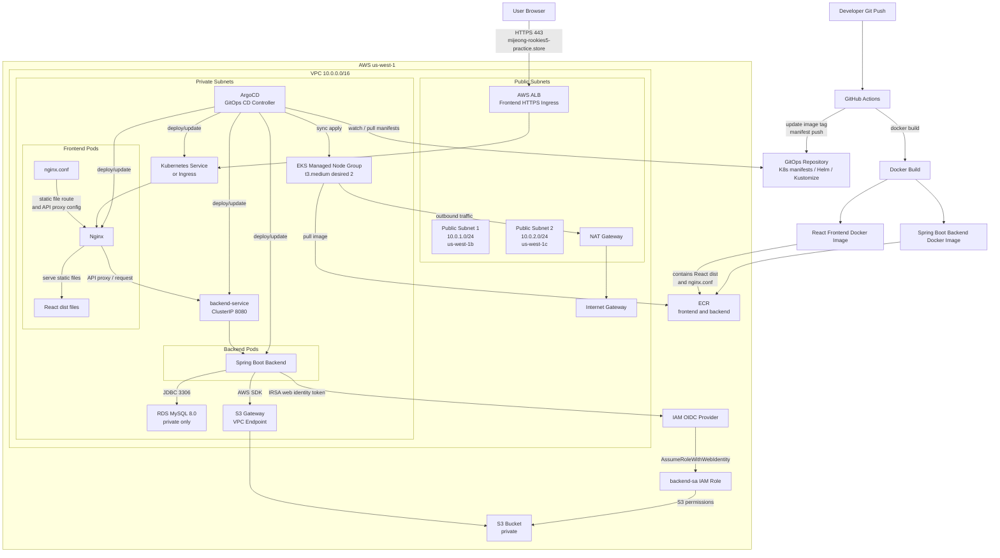
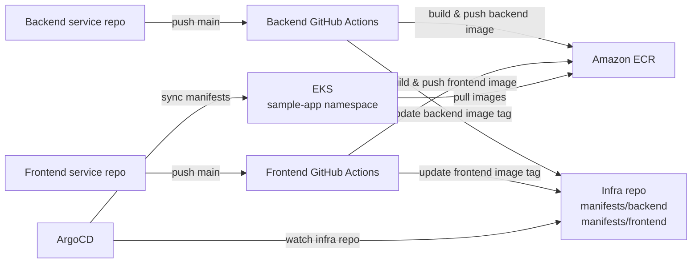

# AWS EKS Infrastructure Automation with Terraform & Kubernetes

Terraform으로 AWS 인프라를 구성하고, EKS 위에 프론트엔드와 백엔드 애플리케이션을 배포하기 위한 프로젝트입니다.

구성 범위는 VPC, public/private subnet, NAT Gateway, EKS cluster/node group, ECR, RDS MySQL, S3 bucket, IAM role, IRSA, ArgoCD 기반 GitOps 배포 환경입니다.

## Overview

이 저장소는 인프라와 Kubernetes 배포 상태를 관리하는 infra repo입니다. 프론트엔드/백엔드 애플리케이션의 빌드 workflow는 각 서비스 repo에서 실행되고, 이 저장소의 `manifests/` 파일만 갱신합니다.

1. Terraform으로 AWS 인프라를 생성합니다.
2. Backend service repo의 GitHub Actions가 백엔드 Docker 이미지를 빌드하고 ECR에 push합니다.
3. Frontend service repo의 GitHub Actions가 프론트엔드 Docker 이미지를 빌드하고 ECR에 push합니다.
4. 각 서비스 repo의 workflow가 이 infra repo를 checkout해서 `manifests/backend` 또는 `manifests/frontend`의 image tag를 갱신하고 push합니다.
5. ArgoCD가 이 infra repo의 `manifests/` 경로를 감시하고 EKS에 동기화합니다.
6. 사용자는 AWS Load Balancer를 통해 프론트엔드에 접속합니다.
7. 프론트엔드 Pod의 Nginx가 React dist 파일을 제공하고, API 요청은 백엔드 서비스로 전달합니다.
8. 백엔드는 RDS MySQL과 S3 bucket에 접근합니다. S3 접근은 IRSA를 사용합니다.

## Repository Roles

| Repository | Role | GitHub Actions 실행 위치 |
| --- | --- | --- |
| Infra repo | Terraform, ArgoCD Application, Kubernetes manifests 관리 | Terraform 실행 및 manifest 변경 commit |
| Backend service repo | Spring Boot backend build, Docker image push, backend manifest image 갱신 | Backend repo의 workflow에서 실행 |
| Frontend service repo | React build, Docker image push, frontend manifest image 갱신 | Frontend repo의 workflow에서 실행 |

서비스 repo의 workflow는 이 infra repo의 workflow를 실행하는 것이 아닙니다. 각 서비스 repo에서 빌드와 ECR push를 수행한 뒤, 이 infra repo의 manifest 파일을 수정해서 push합니다. ArgoCD는 infra repo 변경사항을 감지해 클러스터에 반영합니다.

## Project Structure

루트에는 문서, 스크립트, ArgoCD Application, Kubernetes manifest를 두고 Terraform 코드는 `terraform/` 폴더에 모았습니다.

```text
.
├── README.md
│   └── 인프라 구조, 배포 흐름, 운영 명령어를 정리한 메인 문서
├── docs/
│   └── DEPLOY.md
│       └── 단계별 배포 절차와 확인 명령어
├── argocd/
│   ├── backend-application.yml
│   │   └── manifests/backend 경로를 바라보는 ArgoCD Application
│   └── frontend-application.yml
│       └── manifests/frontend 경로를 바라보는 ArgoCD Application
├── manifests/
│   ├── backend/
│   │   ├── namespace.yaml
│   │   └── backend.yaml
│   │       └── backend ServiceAccount, Secret, Deployment, Service
│   └── frontend/
│       ├── frontend.yaml
│       │   └── frontend Deployment, ClusterIP Service
│       └── ingress.yaml
│           └── ACM 인증서와 ALB Ingress를 사용한 HTTPS 진입점
├── terraform/
│   ├── main.tf
│   ├── vpc.tf
│   ├── eks.tf
│   ├── ecr.tf
│   ├── aws-load-balancer-controller.tf
│   ├── rds.tf
│   ├── s3.tf
│   ├── variables.tf
│   └── outputs.tf
├── scripts/
│   ├── configure-backend-irsa.ps1
│   │   └── Windows PowerShell용 IRSA 설정 스크립트
│   └── configure-backend-irsa.sh
│       └── Ubuntu/Linux Bash용 IRSA 설정 스크립트
└── .gitignore
    └── Terraform state, provider cache, 로컬 생성 파일 제외 규칙
```

## Architecture




## CI/CD Flow

Backend와 Frontend 배포 workflow는 각각의 서비스 repo에서 동작합니다. 이 infra repo는 workflow 실행 주체가 아니라, 서비스 repo workflow가 갱신하는 GitOps 상태 저장소입니다.



백엔드 코드 변경은 backend repo workflow에서 처리하고, 프론트 코드 변경은 frontend repo workflow에서 처리합니다. 두 workflow 모두 최종적으로 이 infra repo의 manifest image 값을 변경하며, ArgoCD는 그 변경사항을 클러스터에 적용합니다.

## Resource Layout

### Network

| Layer | Resource | Purpose |
| --- | --- | --- |
| VPC | `10.0.0.0/16` | AWS 네트워크 경계 |
| Public subnet | `10.0.1.0/24`, `10.0.2.0/24` | Internet Gateway, NAT Gateway, public Load Balancer 배치 |
| Private subnet | `10.0.10.0/24`, `10.0.20.0/24` | EKS node group, RDS 배치 |
| Internet Gateway | `aws_internet_gateway.main` | public subnet의 인터넷 inbound/outbound 경로 |
| NAT Gateway | `aws_nat_gateway.main` | private subnet의 outbound 인터넷 경로 |
| S3 VPC Endpoint | `aws_vpc_endpoint.s3` | private subnet에서 S3로 접근하는 Gateway endpoint |

### Runtime

| Component | Location | Public IP | Notes |
| --- | --- | --- | --- |
| EKS control plane | AWS managed | No direct app access | `kubectl`이 사용하는 관리용 API endpoint |
| EKS worker nodes | Private subnets | No | 애플리케이션 Pod 실행 |
| Frontend Pod | EKS worker node | No | Nginx가 React dist 파일 제공 및 API 요청 전달 |
| Backend Pod | EKS worker node | No | RDS, S3와 통신 |
| RDS MySQL | Private subnets | No | private subnet CIDR에서만 3306 허용 |
| S3 bucket | AWS regional service | N/A | backend가 IRSA role로 접근 |

### Main Resources

| Area | Resource |
| --- | --- |
| Network | VPC, public/private subnets, internet gateway, NAT gateway, route tables |
| Compute | EKS cluster, managed node group |
| Ingress | AWS Load Balancer Controller |
| Registry | ECR repositories for backend and frontend |
| Database | RDS MySQL |
| Storage | S3 bucket, S3 Gateway VPC Endpoint |
| IAM | EKS cluster role, node role, backend service account role, OIDC provider |

## Defaults

| Variable | Default |
| --- | --- |
| `aws_region` | `us-west-1` |
| `project_name` | `sample-app` |
| `environment` | `dev` |
| `vpc_cidr` | `10.0.0.0/16` |
| `public_subnet_cidrs` | `10.0.1.0/24`, `10.0.2.0/24` |
| `private_subnet_cidrs` | `10.0.10.0/24`, `10.0.20.0/24` |
| `kubernetes_version` | `1.32` |
| `kubernetes_namespace` | `sample-app` |
| `backend_service_account_name` | `backend-sa` |
| `aws_load_balancer_controller_chart_version` | `1.14.0` |
| `node_instance_type` | `t3.medium` |
| `node_desired_size` | `2` |
| `node_min_size` | `1` |
| `node_max_size` | `4` |
| `db_instance_class` | `db.t3.micro` |
| `db_name` | `mydb` |
| `db_username` | `admin` |

`db_password`는 기본값이 없습니다. `terraform plan` 또는 `terraform apply` 실행 시 직접 입력하거나 `-var`로 전달해야 합니다.

## Provisioning

Terraform 명령어는 `terraform/` 폴더 안에서 실행합니다.

```powershell
cd terraform
```

### 1. Terraform 초기화

```powershell
terraform init
```

### 2. 변경 계획 확인

```powershell
terraform plan -var="db_password=<db-password>"
```

### 3. 인프라 생성

```powershell
terraform apply -var="db_password=<db-password>"
```

### 4. 출력값 확인

```powershell
terraform output
terraform output -raw rds_db_url
terraform output -raw s3_bucket_name
terraform output -raw backend_sa_role_arn
```

### 5. kubeconfig 설정

```powershell
aws eks update-kubeconfig --region us-west-1 --name sample-app-eks
```

또는 Terraform output의 명령어를 사용할 수 있습니다.

```powershell
terraform output -raw kubeconfig_command
```

작업을 마친 뒤 루트로 돌아오면 ArgoCD manifest와 scripts 경로를 그대로 사용할 수 있습니다.

```powershell
cd ..
```

## Application Deployment

ArgoCD Application manifest를 적용하면 GitOps 저장소의 Kubernetes manifest가 EKS에 동기화됩니다.

```powershell
kubectl apply -f argocd/backend-application.yml
kubectl apply -f argocd/frontend-application.yml
```

상태 확인:

```powershell
kubectl get application -n argocd
kubectl describe application aws-eks-backend -n argocd
kubectl describe application aws-eks-frontend -n argocd
```

서비스와 Ingress 주소 확인:

```powershell
kubectl get svc -n sample-app
kubectl get ingress -n sample-app
```

현재 프론트엔드는 `frontend-service`를 `ClusterIP`로 두고, `frontend-ingress`가 AWS ALB를 생성해 외부 HTTPS 트래픽을 받습니다. 브라우저 접속 주소는 Route 53에서 ALB로 연결한 도메인입니다.

```text
https://mijeong-rookies5-practice.store
```

## ArgoCD

### Install

```powershell
kubectl create namespace argocd
kubectl apply -n argocd -f https://raw.githubusercontent.com/argoproj/argo-cd/stable/manifests/install.yaml --server-side
```

설치 상태 확인:

```powershell
kubectl get pods -n argocd
kubectl rollout status deployment/argocd-server -n argocd --timeout=300s
```

### Expose UI

브라우저에서 ArgoCD UI에 접속하려면 `argocd-server` Service를 `LoadBalancer`로 변경합니다.

```powershell
kubectl patch svc argocd-server -n argocd -p '{"spec": {"type": "LoadBalancer"}}'
kubectl get svc argocd-server -n argocd
```

접속 주소:

```text
https://<EXTERNAL-IP 또는 LoadBalancer DNS>
```

### Initial Password

PowerShell:

```powershell
kubectl -n argocd get secret argocd-initial-admin-secret -o jsonpath="{.data.password}" | %{[System.Text.Encoding]::UTF8.GetString([System.Convert]::FromBase64String($_))}
```

Bash:

```bash
kubectl -n argocd get secret argocd-initial-admin-secret -o jsonpath="{.data.password}" | base64 -d; echo
```

로그인 정보:

```text
URL: https://<EXTERNAL-IP 또는 LoadBalancer DNS>
Username: admin
Password: 위 명령어로 추출한 초기 비밀번호
```

비밀번호를 변경했다면 초기 비밀번호 Secret은 삭제할 수 있습니다.

```powershell
kubectl -n argocd delete secret argocd-initial-admin-secret
```

## AWS Load Balancer Controller

HTTPS Ingress를 사용하려면 EKS에 AWS Load Balancer Controller가 필요합니다. 이 프로젝트는 Terraform에서 다음 항목을 생성하도록 구성되어 있습니다.

- AWS Load Balancer Controller IAM policy
- `kube-system/aws-load-balancer-controller` ServiceAccount
- ServiceAccount용 IRSA IAM role
- Helm chart `eks/aws-load-balancer-controller`

Terraform 적용:

```powershell
cd terraform
terraform init
terraform apply -var="db_password=<db-password>"
cd ..
```

설치 확인:

```powershell
kubectl get deployment -n kube-system aws-load-balancer-controller
kubectl get pods -n kube-system -l app.kubernetes.io/name=aws-load-balancer-controller
```

수동으로 설치해야 하는 경우에는 다음 흐름을 사용합니다.

```powershell
cd terraform
$clusterName = terraform output -raw eks_cluster_name
$vpcId = terraform output -raw vpc_id
$accountId = aws sts get-caller-identity --query Account --output text

Invoke-WebRequest `
  -Uri https://raw.githubusercontent.com/kubernetes-sigs/aws-load-balancer-controller/v2.14.1/docs/install/iam_policy.json `
  -OutFile iam_policy.json

aws iam create-policy `
  --policy-name AWSLoadBalancerControllerIAMPolicy `
  --policy-document file://iam_policy.json

eksctl create iamserviceaccount `
  --cluster $clusterName `
  --namespace kube-system `
  --name aws-load-balancer-controller `
  --role-name AmazonEKSLoadBalancerControllerRole `
  --attach-policy-arn "arn:aws:iam::$accountId:policy/AWSLoadBalancerControllerIAMPolicy" `
  --override-existing-serviceaccounts `
  --region us-west-1 `
  --approve

helm repo add eks https://aws.github.io/eks-charts
helm repo update eks

helm install aws-load-balancer-controller eks/aws-load-balancer-controller `
  -n kube-system `
  --set clusterName=$clusterName `
  --set serviceAccount.create=false `
  --set serviceAccount.name=aws-load-balancer-controller `
  --set region=us-west-1 `
  --set vpcId=$vpcId `
  --version 1.14.0

cd ..
```

## HTTPS Frontend Access

프론트엔드 HTTPS는 `manifests/frontend/ingress.yaml`에서 관리합니다.

```text
User Browser
  -> HTTPS 443
  -> Route 53 mijeong-rookies5-practice.store
  -> AWS ALB created by frontend-ingress
  -> frontend-service ClusterIP:80
  -> frontend Pod Nginx:80
```

현재 설정:

| Item | Value |
| --- | --- |
| Domain | `mijeong-rookies5-practice.store` |
| Kubernetes Ingress | `frontend-ingress` |
| Kubernetes Service | `frontend-service` |
| Service type | `ClusterIP` |
| Listener | HTTP 80, HTTPS 443 |
| TLS certificate | ACM certificate ARN in `manifests/frontend/ingress.yaml` |
| HTTP redirect | `alb.ingress.kubernetes.io/ssl-redirect: "443"` |

Ingress 확인:

```powershell
kubectl get ingress frontend-ingress -n sample-app
kubectl describe ingress frontend-ingress -n sample-app
```

ALB DNS는 `kubectl get ingress`의 `ADDRESS`에 표시됩니다. Route 53에는 루트 도메인 A Alias 레코드로 이 ALB를 연결합니다.

```text
Record name: 비워둠
Record type: A
Alias: Yes
Routing target: Application and Classic Load Balancer
Region: us-west-1
Load balancer: frontend-ingress가 생성한 ALB
```

현재 Ingress rule이 `host: mijeong-rookies5-practice.store`로 제한되어 있으므로 ALB DNS로 직접 접속하면 404가 나올 수 있습니다. 정상 접속 주소는 도메인입니다.

```text
https://mijeong-rookies5-practice.store
```

## Backend Configuration

백엔드 애플리케이션에는 일반적으로 다음 환경 변수가 필요합니다.

```text
DB_URL=<terraform output rds_db_url>
DB_USERNAME=admin
DB_PASSWORD=<terraform apply에 사용한 db_password>
S3_BUCKET_NAME=<terraform output s3_bucket_name>
AWS_REGION=us-west-1
```

현재 구성에서 생성되는 S3 bucket 이름 형식:

```text
sample-app-dev-files-<aws-account-id>-mj
```

## IRSA

백엔드 Pod는 Kubernetes ServiceAccount와 IAM Role을 연결하는 IRSA 방식으로 S3에 접근합니다.

```text
ServiceAccount: system:serviceaccount:sample-app:backend-sa
IAM Role: sample-app-backend-sa-role
```

Terraform apply 후 ServiceAccount annotation을 적용하고 backend Pod를 재시작합니다.

PowerShell:

```powershell
.\scripts\configure-backend-irsa.ps1
```

Bash Ubuntu/Linux:

```bash
chmod +x scripts/configure-backend-irsa.sh
./scripts/configure-backend-irsa.sh
```

환경이 다르면 변수로 값을 바꿔 실행할 수 있습니다.

```bash
CLUSTER_NAME=sample-app-eks REGION=us-west-1 NAMESPACE=sample-app SERVICE_ACCOUNT=backend-sa DEPLOYMENT=backend TERRAFORM_DIR=terraform ./scripts/configure-backend-irsa.sh
```

직접 실행하려면 다음 명령을 사용합니다.

```powershell
kubectl annotate serviceaccount backend-sa -n sample-app eks.amazonaws.com/role-arn=<backend_sa_role_arn> --overwrite
kubectl rollout restart deployment/backend -n sample-app
kubectl rollout status deployment/backend -n sample-app
kubectl exec deployment/backend -n sample-app -- env | Select-String "AWS_ROLE|AWS_WEB_IDENTITY"
```

## Connectivity Checks

### Frontend / Backend

```powershell
kubectl get all -n sample-app
kubectl logs -l app=frontend -n sample-app --tail=100
kubectl logs -l app=backend -n sample-app --tail=100
```

### RDS

RDS는 private subnet에 있고 public access가 꺼져 있으므로 로컬 PC에서 직접 접속하는 것은 기본적으로 차단됩니다. EKS 내부에서 확인하려면 임시 Pod를 사용합니다.

```powershell
kubectl run mysql-test --rm -it --image=mysql:8 --restart=Never -- `
  mysql -h <rds-endpoint> -u admin -p
```

비밀번호는 `terraform apply`에 사용한 `db_password` 값을 입력합니다.

### S3

S3 bucket은 public access block이 켜져 있습니다. 백엔드는 AWS SDK와 IRSA role을 통해 private하게 접근합니다.

```text
Bucket permissions: s3:GetBucketLocation, s3:ListBucket, s3:ListBucketMultipartUploads
Object permissions: s3:GetObject, s3:PutObject, s3:DeleteObject, s3:AbortMultipartUpload, s3:ListMultipartUploadParts
```

## ECR Repositories

```text
sample-app/backend
sample-app/frontend
```

EKS node role에는 `AmazonEC2ContainerRegistryReadOnly` 정책이 연결되어 있어 node가 ECR에서 이미지를 pull할 수 있습니다.
