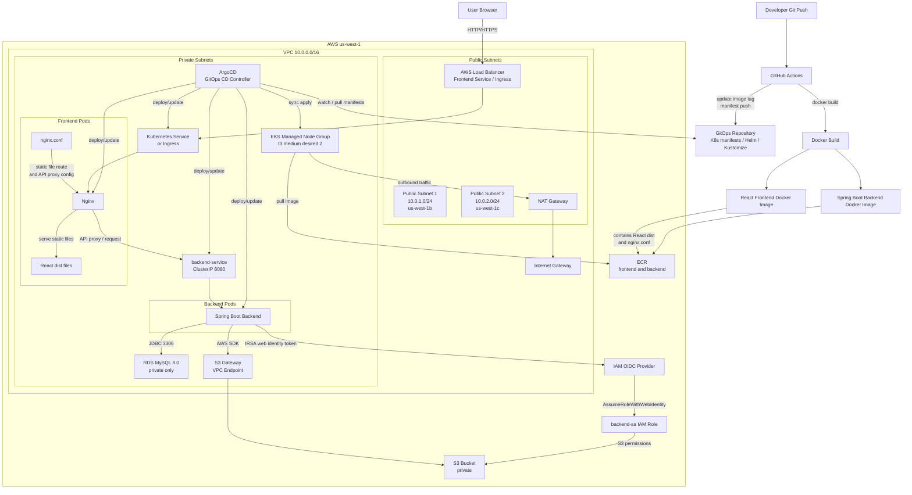

# AWS EKS Infrastructure Automation with Terraform & Kubernetes

Terraform으로 AWS 인프라를 구성하고, EKS 위에 프론트엔드와 백엔드 애플리케이션을 배포하기 위한 프로젝트입니다.

구성 범위는 VPC, public/private subnet, NAT Gateway, EKS cluster/node group, ECR, RDS MySQL, S3 bucket, IAM role, IRSA, ArgoCD 기반 GitOps 배포 환경입니다.

## Overview

이 프로젝트는 다음 흐름으로 동작합니다.

1. Terraform으로 AWS 인프라를 생성합니다.
2. GitHub Actions가 프론트엔드/백엔드 Docker 이미지를 빌드하고 ECR에 push합니다.
3. ArgoCD가 GitOps 저장소의 Kubernetes manifest를 감시하고 EKS에 동기화합니다.
4. 사용자는 AWS Load Balancer를 통해 프론트엔드에 접속합니다.
5. 프론트엔드 Pod의 Nginx가 React dist 파일을 제공하고, API 요청은 백엔드 서비스로 전달합니다.
6. 백엔드는 RDS MySQL과 S3 bucket에 접근합니다. S3 접근은 IRSA를 사용합니다.

## Architecture




## Resource Layout

### Network

| Layer | Resource | Purpose |
| --- | --- | --- |
| VPC | `10.0.0.0/16` | AWS 네트워크 경계 |
| Public subnet | `10.0.1.0/24`, `10.0.2.0/24` | Internet Gateway, NAT Gateway, public Load Balancer 배치 |
| Private subnet | `10.0.10.0/24`, `10.0.20.0/24` | EKS node group, RDS 배치 |
| Internet Gateway | `aws_internet_gateway.main` | public subnet의 인터넷 inbound/outbound 경로 |
| NAT Gateway | `aws_nat_gateway.main` | private subnet의 outbound 인터넷 경로 |
| S3 VPC Endpoint | `aws_vpc_endpoint.s3` | private subnet에서 S3로 접근하는 Gateway endpoint |

### Runtime

| Component | Location | Public IP | Notes |
| --- | --- | --- | --- |
| EKS control plane | AWS managed | No direct app access | `kubectl`이 사용하는 관리용 API endpoint |
| EKS worker nodes | Private subnets | No | 애플리케이션 Pod 실행 |
| Frontend Pod | EKS worker node | No | Nginx가 React dist 파일 제공 및 API 요청 전달 |
| Backend Pod | EKS worker node | No | RDS, S3와 통신 |
| RDS MySQL | Private subnets | No | private subnet CIDR에서만 3306 허용 |
| S3 bucket | AWS regional service | N/A | backend가 IRSA role로 접근 |

### Main Resources

| Area | Resource |
| --- | --- |
| Network | VPC, public/private subnets, internet gateway, NAT gateway, route tables |
| Compute | EKS cluster, managed node group |
| Registry | ECR repositories for backend and frontend |
| Database | RDS MySQL |
| Storage | S3 bucket, S3 Gateway VPC Endpoint |
| IAM | EKS cluster role, node role, backend service account role, OIDC provider |

## Defaults

| Variable | Default |
| --- | --- |
| `aws_region` | `us-west-1` |
| `project_name` | `sample-app` |
| `environment` | `dev` |
| `vpc_cidr` | `10.0.0.0/16` |
| `public_subnet_cidrs` | `10.0.1.0/24`, `10.0.2.0/24` |
| `private_subnet_cidrs` | `10.0.10.0/24`, `10.0.20.0/24` |
| `kubernetes_version` | `1.32` |
| `kubernetes_namespace` | `sample-app` |
| `backend_service_account_name` | `backend-sa` |
| `node_instance_type` | `t3.medium` |
| `node_desired_size` | `2` |
| `node_min_size` | `1` |
| `node_max_size` | `4` |
| `db_instance_class` | `db.t3.micro` |
| `db_name` | `mydb` |
| `db_username` | `admin` |

`db_password`는 기본값이 없습니다. `terraform plan` 또는 `terraform apply` 실행 시 직접 입력하거나 `-var`로 전달해야 합니다.

## Provisioning

### 1. Terraform 초기화

```powershell
terraform init
```

### 2. 변경 계획 확인

```powershell
terraform plan -var="db_password=<db-password>"
```

### 3. 인프라 생성

```powershell
terraform apply -var="db_password=<db-password>"
```

### 4. 출력값 확인

```powershell
terraform output
terraform output -raw rds_db_url
terraform output -raw s3_bucket_name
terraform output -raw backend_sa_role_arn
```

### 5. kubeconfig 설정

```powershell
aws eks update-kubeconfig --region us-west-1 --name sample-app-eks
```

또는 Terraform output의 명령어를 사용할 수 있습니다.

```powershell
terraform output -raw kubeconfig_command
```

## Application Deployment

ArgoCD Application manifest를 적용하면 GitOps 저장소의 Kubernetes manifest가 EKS에 동기화됩니다.

```powershell
kubectl apply -f sample-application.yml
kubectl apply -f frontend-application.yml
```

상태 확인:

```powershell
kubectl get application -n argocd
kubectl describe application awseks-backend -n argocd
kubectl describe application awseks-frontend -n argocd
```

서비스 주소 확인:

```powershell
kubectl get svc -A
kubectl get ingress -A
```

`TYPE=LoadBalancer` 서비스의 `EXTERNAL-IP` 또는 Ingress의 `ADDRESS`가 브라우저 접속 주소입니다.

## ArgoCD

### Install

```powershell
kubectl create namespace argocd
kubectl apply -n argocd -f https://raw.githubusercontent.com/argoproj/argo-cd/stable/manifests/install.yaml --server-side
```

설치 상태 확인:

```powershell
kubectl get pods -n argocd
kubectl rollout status deployment/argocd-server -n argocd --timeout=300s
```

### Expose UI

브라우저에서 ArgoCD UI에 접속하려면 `argocd-server` Service를 `LoadBalancer`로 변경합니다.

```powershell
kubectl patch svc argocd-server -n argocd -p '{"spec": {"type": "LoadBalancer"}}'
kubectl get svc argocd-server -n argocd
```

접속 주소:

```text
https://<EXTERNAL-IP 또는 LoadBalancer DNS>
```

### Initial Password

PowerShell:

```powershell
kubectl -n argocd get secret argocd-initial-admin-secret -o jsonpath="{.data.password}" | %{[System.Text.Encoding]::UTF8.GetString([System.Convert]::FromBase64String($_))}
```

Bash:

```bash
kubectl -n argocd get secret argocd-initial-admin-secret -o jsonpath="{.data.password}" | base64 -d; echo
```

로그인 정보:

```text
URL: https://<EXTERNAL-IP 또는 LoadBalancer DNS>
Username: admin
Password: 위 명령어로 추출한 초기 비밀번호
```

비밀번호를 변경했다면 초기 비밀번호 Secret은 삭제할 수 있습니다.

```powershell
kubectl -n argocd delete secret argocd-initial-admin-secret
```

## Backend Configuration

백엔드 애플리케이션에는 일반적으로 다음 환경 변수가 필요합니다.

```text
DB_URL=<terraform output rds_db_url>
DB_USERNAME=admin
DB_PASSWORD=<terraform apply에 사용한 db_password>
S3_BUCKET_NAME=<terraform output s3_bucket_name>
AWS_REGION=us-west-1
```

현재 구성에서 생성되는 S3 bucket 이름 형식:

```text
sample-app-dev-files-<aws-account-id>-mj
```

## IRSA

백엔드 Pod는 Kubernetes ServiceAccount와 IAM Role을 연결하는 IRSA 방식으로 S3에 접근합니다.

```text
ServiceAccount: system:serviceaccount:sample-app:backend-sa
IAM Role: sample-app-backend-sa-role
```

Terraform apply 후 ServiceAccount annotation을 적용하고 backend Pod를 재시작합니다.

```powershell
.\scripts\configure-backend-irsa.ps1
```

직접 실행하려면 다음 명령을 사용합니다.

```powershell
kubectl annotate serviceaccount backend-sa -n sample-app eks.amazonaws.com/role-arn=<backend_sa_role_arn> --overwrite
kubectl rollout restart deployment/backend -n sample-app
kubectl rollout status deployment/backend -n sample-app
kubectl exec deployment/backend -n sample-app -- env | Select-String "AWS_ROLE|AWS_WEB_IDENTITY"
```

## Connectivity Checks

### Frontend / Backend

```powershell
kubectl get all -n sample-app
kubectl logs -l app=frontend -n sample-app --tail=100
kubectl logs -l app=backend -n sample-app --tail=100
```

### RDS

RDS는 private subnet에 있고 public access가 꺼져 있으므로 로컬 PC에서 직접 접속하는 것은 기본적으로 차단됩니다. EKS 내부에서 확인하려면 임시 Pod를 사용합니다.

```powershell
kubectl run mysql-test --rm -it --image=mysql:8 --restart=Never -- `
  mysql -h <rds-endpoint> -u admin -p
```

비밀번호는 `terraform apply`에 사용한 `db_password` 값을 입력합니다.

### S3

S3 bucket은 public access block이 켜져 있습니다. 백엔드는 AWS SDK와 IRSA role을 통해 private하게 접근합니다.

```text
Bucket permissions: s3:GetBucketLocation, s3:ListBucket, s3:ListBucketMultipartUploads
Object permissions: s3:GetObject, s3:PutObject, s3:DeleteObject, s3:AbortMultipartUpload, s3:ListMultipartUploadParts
```

## ECR Repositories

```text
sample-app/backend
sample-app/frontend
```

EKS node role에는 `AmazonEC2ContainerRegistryReadOnly` 정책이 연결되어 있어 node가 ECR에서 이미지를 pull할 수 있습니다.
