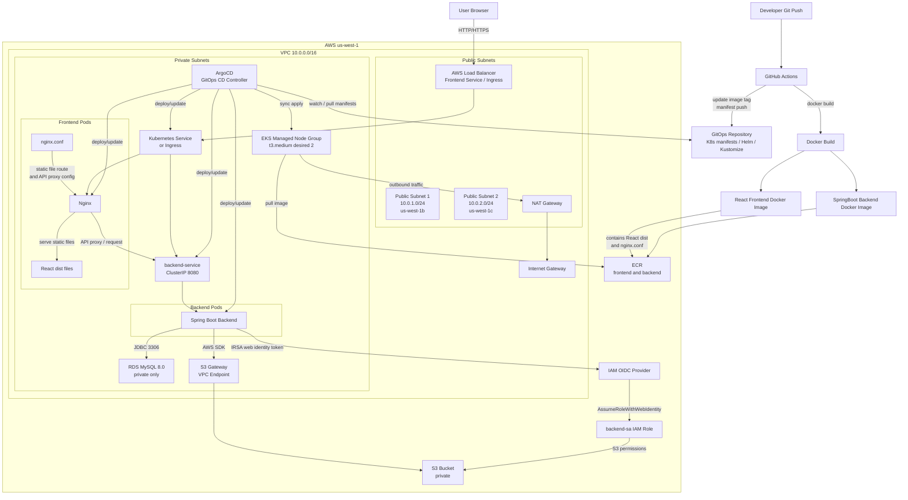

# AWS EKS Infrastructure Automation with Terraform & Kubernetes

이 프로젝트는 Terraform으로 AWS 인프라를 자동 구성하고, EKS 기반 애플리케이션 실행 환경과 ArgoCD 기반 GitOps 배포/운영 환경을 생성하는 프로젝트입니다.

구성 대상은 VPC, public/private subnet, NAT gateway, EKS cluster/node group, ECR, RDS MySQL, S3 bucket, IAM role 및 IRSA입니다. 또한 ArgoCD 설치, 초기 비밀번호 확인, 웹 UI 접속 가이드를 포함합니다.

## Architecture

ArgoCD는 Kubernetes 클러스터 내부에서 동작하며, Git 저장소와 클러스터 사이를 끊임없이 비교하고 맞추는 역할을 합니다.


```text
[개발자] -- Push --> [Git Repository] (원하는 상태: Desired State)
                            ^
                            | 1. 감시 및 Pull
+---------------------------+----------------------------+
|                         ArgoCD                        |
|  +-------------+    +----------------+                |
|  | API Server  |    | Repo Server    |                |
|  | (UI / CLI)  |    | (Git 연결,     |                |
|  +-------------+    | 매니페스트 해석) |                |
|                     +----------------+                |
|                                                        |
|  +-----------------------------------+                 |
|  | Application Controller            | <- 2. 비교/대조 |
|  | (상태 감시 & 동기화 실행)         |                 |
|  +-----------------------------------+                 |
+---------------------------+----------------------------+
                            | 3. 배포 (Apply)
                            v
                [Kubernetes Cluster] (실제 상태: Live State)
```

```text
AWS Region: us-west-1

VPC 10.0.0.0/16
├─ Public Subnet 1  10.0.1.0/24   us-west-1b
│  ├─ Internet Gateway route
│  ├─ NAT Gateway
│  └─ Frontend LoadBalancer entry point
├─ Public Subnet 2  10.0.2.0/24   us-west-1c
│  └─ Internet Gateway route
├─ Private Subnet 1 10.0.10.0/24  us-west-1b
│  ├─ EKS managed node group
│  ├─ Frontend pods
│  ├─ Backend pods
│  └─ RDS subnet group
└─ Private Subnet 2 10.0.20.0/24  us-west-1c
   ├─ EKS managed node group
   ├─ Frontend pods
   ├─ Backend pods
   └─ RDS subnet group

External services
├─ ECR: backend/frontend container images
├─ S3: uploaded files
├─ IAM/OIDC: IRSA for backend S3 access
└─ GitHub Actions: CI/CD runner
```



### AWS Network Layout

| Layer | Resource | Purpose |
| --- | --- | --- |
| VPC | `10.0.0.0/16` | 전체 AWS 네트워크 경계 |
| Public subnet | `10.0.1.0/24`, `10.0.2.0/24` | Internet Gateway, NAT Gateway, public Load Balancer 배치 |
| Private subnet | `10.0.10.0/24`, `10.0.20.0/24` | EKS node group, RDS 배치 |
| Internet Gateway | `aws_internet_gateway.main` | public subnet의 인터넷 inbound/outbound 경로 |
| NAT Gateway | `aws_nat_gateway.main` | private subnet의 outbound 인터넷 경로 |

### EKS Runtime Layout

| Component | Location | Public IP | Notes |
| --- | --- | --- | --- |
| EKS control plane | AWS managed | No direct app access | `kubectl`이 사용하는 관리용 API endpoint |
| EKS worker nodes | Private subnets | No | 애플리케이션 Pod 실행 |
| Frontend Pod | EKS worker node | No | Service 또는 Ingress 뒤에서 노출 |
| Backend Pod | EKS worker node | No | RDS, S3와 통신 |
| RDS MySQL | Private subnets | No | private subnet CIDR에서만 3306 허용 |
| S3 bucket | AWS regional service | N/A | backend가 IRSA role로 접근 |

사용자 브라우저는 EKS API endpoint로 접속하지 않습니다. 실제 배포 URL은 Kubernetes `Service` 또는 `Ingress`가 생성한 AWS Load Balancer 주소입니다.

```powershell
kubectl get svc -A
kubectl get ingress -A
```

`TYPE=LoadBalancer`인 Service의 `EXTERNAL-IP` 또는 Ingress의 `ADDRESS`가 프론트엔드/백엔드 접속 주소입니다.

## Communication Flow

### Backend to RDS

RDS는 private subnet에 배치되고 public access가 꺼져 있습니다.

```hcl
publicly_accessible = false
```

RDS security group은 private subnet CIDR에서 들어오는 MySQL 트래픽만 허용합니다.

```text
Allowed inbound:
10.0.10.0/24 -> TCP 3306
10.0.20.0/24 -> TCP 3306
```

따라서 로컬 PC에서 RDS endpoint로 직접 접속하면 timeout이 나는 것이 정상입니다. 백엔드가 EKS private node 위에서 실행될 때 RDS에 접근할 수 있습니다.

### Backend to S3

백엔드 Pod는 IRSA 구성을 통해 S3 접근용 IAM role을 사용합니다. S3 bucket은 public access block이 켜져 있으므로 외부에 공개되지 않고, 백엔드가 AWS SDK로 업로드/조회합니다.

```text
ServiceAccount: system:serviceaccount:sample-app:backend-sa
IAM Role: sample-app-backend-sa-role
S3 bucket: sample-app-dev-files-<aws-account-id>-mj
```

현재 IAM inline policy는 `Resource = "*"`가 아니라 Terraform이 생성한 S3 bucket ARN으로 제한됩니다.

```text
Bucket permissions: s3:GetBucketLocation, s3:ListBucket, s3:ListBucketMultipartUploads
Object permissions: s3:GetObject, s3:PutObject, s3:DeleteObject, s3:AbortMultipartUpload, s3:ListMultipartUploadParts
```

private subnet의 EKS node/Pod가 S3에 접근할 수 있도록 S3 Gateway VPC Endpoint도 생성합니다. 따라서 S3 트래픽은 NAT Gateway/Internet Gateway 경로가 아니라 VPC endpoint 경로를 사용합니다.

```text
Terraform resource: aws_vpc_endpoint.s3
Endpoint type: Gateway
Route table: private route table
```

Terraform apply 후 ServiceAccount annotation을 적용하고 backend Pod를 재시작합니다.

```powershell
terraform apply -var="db_password=<db-password>"
.\scripts\configure-backend-irsa.ps1
```

직접 실행하려면 아래 명령을 사용합니다.

```powershell
kubectl annotate serviceaccount backend-sa -n sample-app eks.amazonaws.com/role-arn=<backend_sa_role_arn> --overwrite
kubectl rollout restart deployment/backend -n sample-app
kubectl rollout status deployment/backend -n sample-app
kubectl exec deployment/backend -n sample-app -- env | Select-String "AWS_ROLE|AWS_WEB_IDENTITY"
```
### EKS to ECR

백엔드와 프론트엔드 이미지는 ECR repository에 저장됩니다.

```text
sample-app/backend
sample-app/frontend
```

EKS node role에는 ECR read-only 정책이 연결되어 있어 node가 ECR에서 이미지를 pull 할 수 있습니다.

## Main Resources

| Area | Resource |
| --- | --- |
| Network | VPC, public/private subnets, internet gateway, NAT gateway, route tables |
| Compute | EKS cluster, managed node group |
| Registry | ECR repositories for backend and frontend |
| Database | RDS MySQL |
| Storage | S3 bucket |
| IAM | EKS cluster role, node role, backend service account role, OIDC provider |

## Current Defaults

| Variable | Default |
| --- | --- |
| `aws_region` | `us-west-1` |
| `project_name` | `sample-app` |
| `environment` | `dev` |
| `db_name` | `mydb` |
| `db_username` | `admin` |
| `kubernetes_version` | `1.32` |
| `node_instance_type` | `t3.medium` |

`db_password`는 기본값이 없습니다. `terraform plan` 또는 `terraform apply` 실행 시 직접 입력하거나 `-var`로 전달해야 합니다.

```powershell
terraform apply -var 'db_password=<db-password>'
```

## Usage

초기화:

```powershell
terraform init
```

변경 계획 확인:

```powershell
terraform plan -var 'db_password=<db-password>'
```

적용:

```powershell
terraform apply -var 'db_password=<db-password>'
```

출력 확인:

```powershell
terraform output
terraform output -raw rds_db_url
terraform output -raw s3_bucket_name
```

EKS kubeconfig 설정:

```powershell
aws eks update-kubeconfig --region us-west-1 --name sample-app-eks
```

## ArgoCD Install and Access Guide

이 문서는 EKS 클러스터에 ArgoCD를 설치하고 초기 비밀번호를 확인하여 웹 UI에 접속하는 과정을 안내합니다.

### 1. ArgoCD 설치

ArgoCD를 설치할 namespace를 생성하고 공식 매니페스트를 배포합니다.

```powershell
kubectl create namespace argocd
kubectl apply -n argocd -f https://raw.githubusercontent.com/argoproj/argo-cd/stable/manifests/install.yaml --server-side
```

설치 상태 확인:

```powershell
kubectl get pods -n argocd
kubectl rollout status deployment/argocd-server -n argocd --timeout=300s
```

### 2. 외부 접속 허용 LoadBalancer

기본적으로 ArgoCD server는 클러스터 내부에서만 접근 가능합니다. 웹 브라우저로 접근하려면 `argocd-server` Service type을 `LoadBalancer`로 변경합니다.

```powershell
kubectl patch svc argocd-server -n argocd -p '{"spec": {"type": "LoadBalancer"}}'
kubectl get svc argocd-server -n argocd
```

`EXTERNAL-IP` 항목에 나오는 DNS 주소를 복사하여 브라우저에서 접속합니다.

```text
https://<EXTERNAL-IP 또는 LoadBalancer DNS>
```

인증서 경고가 뜨면 `고급`을 선택한 뒤 안전하지 않음으로 이동합니다. ArgoCD 기본 인증서가 자체 서명 인증서라서 발생하는 경고입니다.

Bash 환경에서는 patch 명령을 아래처럼 실행할 수 있습니다.

```bash
kubectl patch svc argocd-server -n argocd -p '{"spec": {"type": "LoadBalancer"}}'
```

### 3. 초기 비밀번호 확인 및 로그인

ArgoCD의 기본 관리자 계정은 `admin`이며, 초기 비밀번호는 클러스터 Secret에 저장되어 있습니다.

PowerShell:

```powershell
kubectl -n argocd get secret argocd-initial-admin-secret -o jsonpath="{.data.password}" | %{[System.Text.Encoding]::UTF8.GetString([System.Convert]::FromBase64String($_))}
```

Bash:

```bash
kubectl -n argocd get secret argocd-initial-admin-secret -o jsonpath="{.data.password}" | base64 -d; echo
```

로그인 정보:

```text
URL: https://<EXTERNAL-IP 또는 LoadBalancer DNS>
Username: admin
Password: 위 명령어로 추출한 비밀번호
```

### 4. 초기 비밀번호 삭제 선택

로그인 후 관리자 비밀번호를 변경했다면 초기 비밀번호 Secret을 삭제합니다.

```powershell
kubectl -n argocd delete secret argocd-initial-admin-secret
```
## Backend Environment Values

백엔드 애플리케이션에는 보통 아래 값이 필요합니다.

```text
DB_URL=<terraform output rds_db_url>
DB_USERNAME=admin
DB_PASSWORD=<terraform apply에 사용한 db_password>
S3_BUCKET_NAME=<terraform output s3_bucket_name>
AWS_REGION=us-west-1
```

현재 구성에서 생성되는 S3 bucket 이름은 다음 형식입니다.

```text
sample-app-dev-files-<aws-account-id>-mj
```

## DB Connectivity Check

로컬 PC에서 RDS로 직접 접속하는 것은 기본 구성상 차단됩니다. EKS 내부에서 확인하려면 임시 Pod를 사용합니다.

```powershell
kubectl run mysql-test --rm -it --image=mysql:8 --restart=Never -- `
  mysql -h <rds-endpoint> -u admin -p
```

비밀번호는 `terraform apply`에 사용한 `db_password` 값을 입력합니다.
